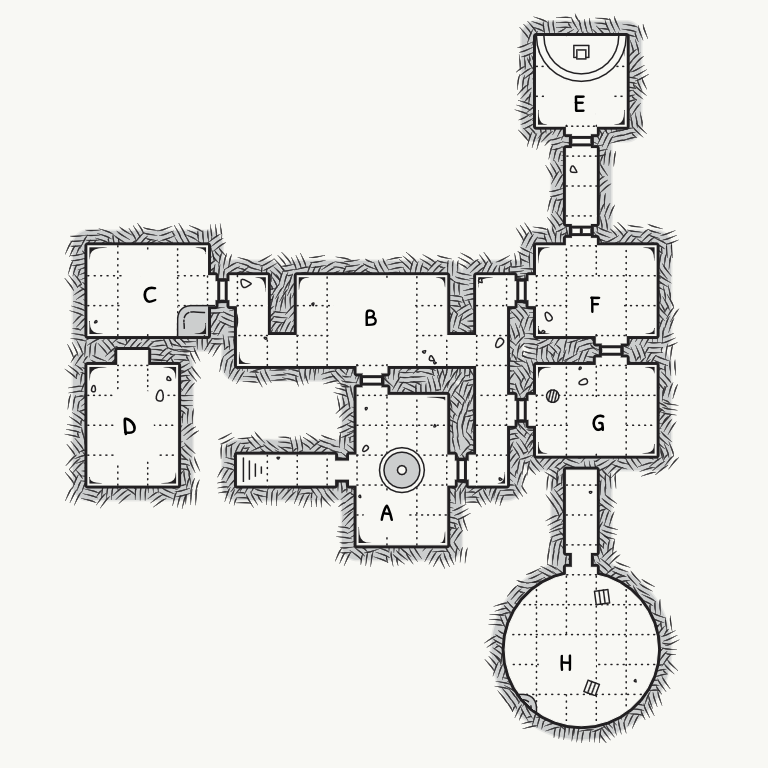

# Scenario
Sorrel falls asleep with pain medication after trying to explain faeries to Fox. She has a dream where she is Amaryllis again,this time running away from home when she was young and being attacked in the woods by wolves. She is saved when her powers activate and her eyes change.

Filler episode: haunted house caused by illusion magic? Psilocybin (magic mushrooms) uses earth magic and spores to cast illusions. Fern trapped by the spell and Ashe comes to Sorrel for help getting her back.

Psilocybin is friends with Shade, and Sorrel has met him before.

| ID | Desc |
|:---:|:--- |
| a | foyer, old peeling wallpaper, ghost in wardrobe (1d6) |
| b | dining room, floating dinnerware |
| c | painting room, ghost painting shadows of party, locked door (3d12) |
| d | real fern, sleeping in a satin bed |
| e | Cybin's throne room |
| f | rat lever opens door (2d8) |
| g | library, hidden wall behind bookcase |
| h | fake fern (8d8) in cage above spike trap, key |

Cy tells Shade about Kiss

---

Sorrel agrees to take Fox to go and see Jacob. Jacob gives him the rundown and Sorrel wants to see the Sprawl with Fox and wants to check in with Buckeye about the things happening. Dahlia's men have a section of the Sprawl tented off and aren't letting anyone in. The fae are very conflicted about Fox knowing  and being shown around; Lobelia makes a fuss about Sorrel having told a human about the fae while also telling them to stay hidden.

Alder wants to talk to Sorrel about the odd jones she's been going for Jacob, as she's been helping him in secret and Jacob should be going through proper channels to address escapees.

Battle of the Bands is a little more than a week away, and Fox and Sorrel still need to practice.

Beech gets kicked out of Madame Bogart's Dance Academy, but it really wasn't her fault.

---

Titania is dead and Oberon is still around trying to cling to power. Maple knows, Alder doesn't.

Astrid killed Titania?

---

Need to make a trailer/preview.

# Threads
|:--- |
| Titania's diary |
| Practice for BotB |
| Take Fox to the Sprawl |
| Apologize for losing Moonwort |

# NPC Review
|:--- |
| Fox wants to know more about the fae and has questions about magic, so he will follow Sorrel more closely. |
| Jacob wants to get Moonwort back but has no leads and is worried about the Twilight not being safe with Jasper still about. |
| Dahlia offers to retrieve Jasper from the Twilight but wants Sorrel to sing for her as the price. |
| Hemlock has been practicing sax and shows up to sign for BotB. Oyster makes electronic music with a synth board. |
| Beech is kicked out of the dance academy for fighting (surprisingly not her fault) and goes back to working for Hemlock. |

Titania was a valkyrie and Oberon was a sea dragon. Alder is a dragon, so Sorrel is 2/4 fire dragon, 1/4 sea dragon and 1/4 valkyrie, making her a light dragon.

Titania married Oberon as a political move to join the two most powerful of the fae kingdoms and expand their reach, a strategy taken from the humans and perfected with fae magic. There was resistance and the many smaller groups banded together to form their own court, the Unseelie. There were clashes back and forth for centuries and there were many tragic losses caused by human interaction with the fae.

Titania and Oberon ruled with strict rules for the fae to avoid human interaction and live in either the Twilight or the Antipode. When the fae became more feral from being closer to their wild origins, they loosened the laws to allow for glamoured spots near human settlements, with harsh punishments for rulebreakers. Using magic, the court slowly removed faeries from the minds of mankind, trying unsuccessfully to remove magic from mankind as well.

After Maple's birth, a truce was signed between the Seelie and Unseelie courts which stopped much of the fighting between the fae, but it was more out of need to keep the fae hidden than to stop the clashing between courts.

Titania writes fondly of Oberon, impressed by his temperment, just attitude, and good sports muscles.

