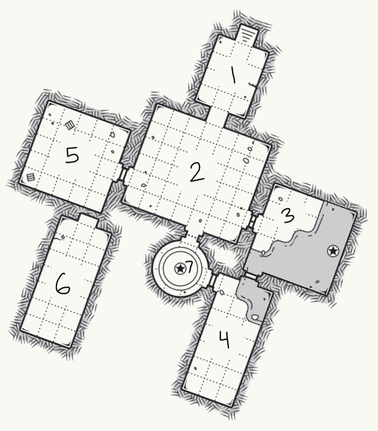
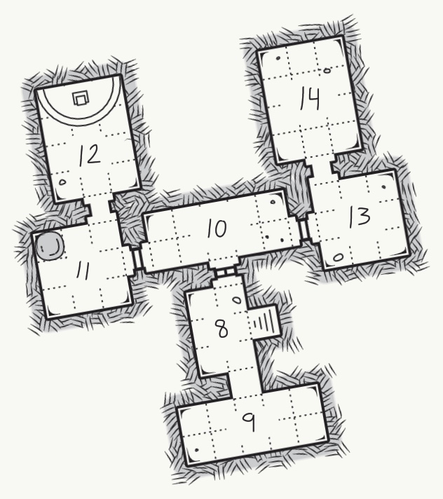

| id | name | description |
|:---:|:---:|:--- |
|  1 | Foyer |  |
|  2 | Grand Hall | **Sanguinaria** L3 Maid |
|  3 | Dining Hall |  |
|  4 | Kitchens | **Celandine** L5 Servant |
|  5 | Tea Room | **Belladonna** L6 Duchess **Iresine** L5 Duchess |
|  6 | Greenhouse | **Dracaena** L4 Gardener |
|  7 | Spiral Staircase |  |

| id | name | description |
|:---:|:---:|:--- |
|  8 | Stair landing | Secret Panel |
|  9 | Balcony | 2 L4 Gargoyle Guards |
| 10 | Hallway | **Scadoxus** L6 Lord |
| 11 | Master Bedroom | **Haemanthus** L4       Butler |
| 12 | Master Study | Family History in Library Section |
| 13 | Bathing Room | **Oleander** L5 Lord |
| 14 | Sleeping Chambers | **Cinnabari** L4 Servant |